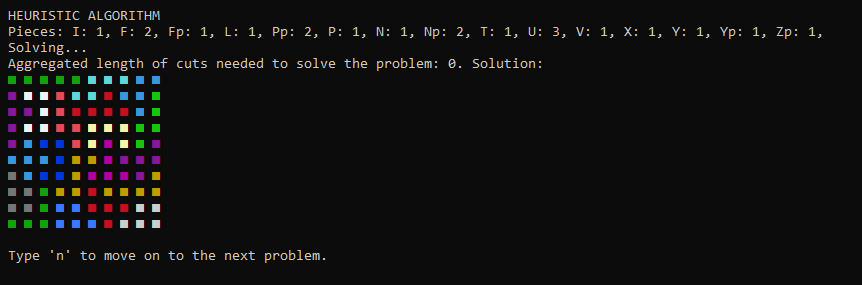

# Rectangle tiling with cuts

Functionality:
* optimal algorithm - algorithm finding all possible solutions with the least number of cuts (exponential)
* heuristic algorithm - algorithm finding only one solution, not necessarily the best, but in a much shorter time ($\Theta((4n)^3)$)

The program has two ways of input:
* file - a list of problems to solve is read from **input.txt**
* console - in case of a missing file the program asks to input the parameters in console

File input:
* first line always contains **5** (as the program only solves pentomino puzzles)
* second line tells the program to use the optimal or heuristic algorithm (**hp** or **op**)
* third line gives the program an integer corresponding to a number of pentominoes to be drawn or a list of integers each corresponding to the number of individual pentominoes
* multiple problems might be entered one after another

Example input is given in the file **input.txt**.

The list of pentominoes corresponds to the pentominoes shown below.

.

A screenshot of the app is shown below.

